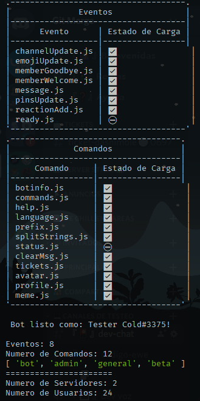

<h1 align="center">
	🤖ℂ𝕠𝕝𝕕 𝔹𝕠𝕥🔵
</h1>

## 𝔻𝕖𝕤𝕔𝕣𝕚𝕡𝕔𝕚𝕠́𝕟

Cold Bot ha sido creado por mero autoaprendizaje y por esta misma razón Cold Bot es de codigo abierto(Open Source).

Aún asi no vendria mal un respectivo credito <3

Aqui Puedes Encontrar:

- Bot Multilenguaje
- Cooldown
- Mensajes de Bienvenida/Despedida
- Tickets para dar soportes.
- Logs de acciones
- Command Handler y Event Handler

En busca de tener un estado mas rapido de todos los comandos y eventos, por consola nos creara una tabla con el estado de los comandos, eventos y lenguajes. siguiendo una estructura base.

<p align="center">
	
</p>

## 𝕀𝕟𝕤𝕥𝕒𝕝𝕒𝕔𝕚𝕠́𝕟

1. Al clonar el proyecto, es recomendable usar npm.

Instalacion de Dependencias.
```sh
npm install
```

2. Crear archivo **.env** con las variables de entorno mencionadas.

3. Para Usar el Bot de forma local
```sh
npm run dev
```

1. Para llevar el bot a producción, es necesario que uses el build ya que el bot usa ESM
```sh
npm run build && npm start
```

## 𝕍𝕒𝕣𝕚𝕒𝕓𝕝𝕖𝕤 𝕕𝕖 𝔼𝕟𝕥𝕠𝕣𝕟𝕠

- PASSWORD

> Token del Bot

- WEBHOOKWELCOME

> Webhook de discord para enviar Mensajes de Bienvenida/Despedida

- WEBHOOKLOGS

> Webhook de discord para enviar los logs

- IDSERVER

> Id del servidor (Por Ahora funciona asi para enviar los mensajes de Bienvenida/Despedida).

- DBNAME

> Nombre de la base de datos, Opcional

- ZEEW

> Si Tienes Token de [Zeew][enlacezeew] y quieres usar sus mensajes de Bienvenida, Usa esta Variable ;)

[enlacezeew]: https://www.npmjs.com/package/zeew
